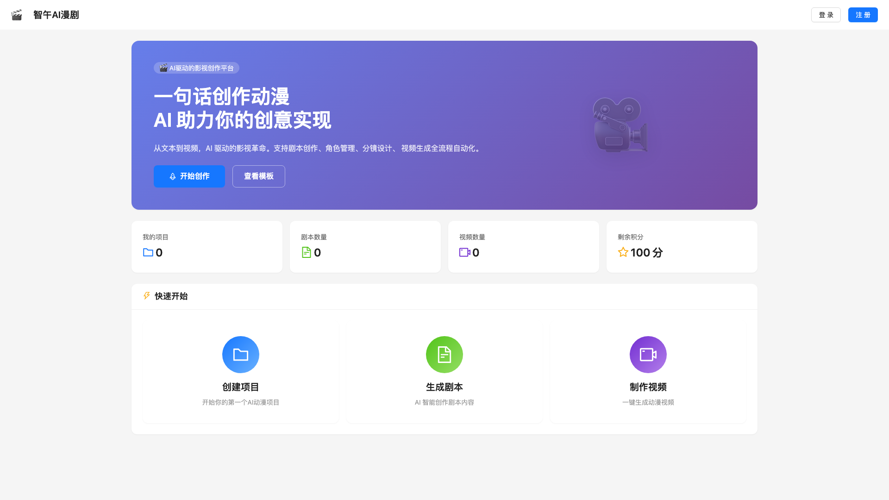
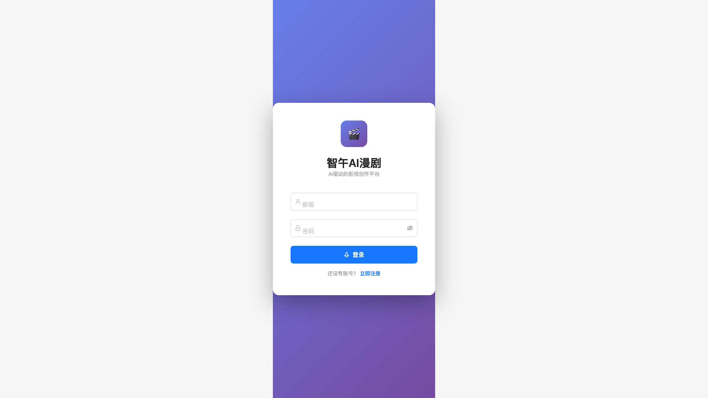

<h1 align="center">
  <br>
  <a href="https://github.com/Z5Research/ai-drama-platform">
    
  </a>
  <br>
  AI Drama Video Creation Platform
  <br>
</h1>

<p align="center">
  <a href="README_CN.md">🇨🇳 中文</a> •
  <a href="README_EN.md">🇺🇸 English</a>
</p>

<h4 align="center">End-to-End AI Drama Video Creation Platform - From One-Liner Idea to Complete Video</h4>
<h4 align="center">端到端AI漫剧视频创作平台 - 从一句话创意到完整视频</h4>

<p align="center">
  <a href="LICENSE">
    
  </a>
  <a href="#features">
    
  </a>
  <a href="#tech-stack">
    
  </a>
  <a href="#tech-stack">
    
  </a>
  <a href="#models">
    
  </a>
</p>

<br>

<p align="center">
  
</p>

<p align="center">
  <a href="#features">Features</a> •
  <a href="#tech-stack">Tech Stack</a> •
  <a href="#quick-start">Quick Start</a> •
  <a href="#architecture">Architecture</a> •
  <a href="#api-reference">API</a> •
  <a href="#license">License</a>
</p>

---

## Overview | 概述

**AI Drama Platform** is a complete end-to-end video creation platform powered by AI. Transform a one-liner creative idea into a complete drama video with character consistency, professional storyboards, and automated video generation.

**AI漫剧视频创作平台**是一个完整的端到端AI视频创作系统。将一句话创意转化为完整的漫剧视频，支持角色一致性、专业分镜和自动化视频生成。

### Key Highlights | 核心亮点

- 🎬 **End-to-End Automation** - From idea to video in 7 stages
- 🎭 **Character Consistency** - AI-powered appearance consistency across shots
- 📊 **Professional Storyboard** - Visual editing with standard terminology
- 🎥 **Multi-Model Integration** - LLM + Image Generation + Video Generation
- 🔐 **User Authentication** - JWT-based auth with credit system
- 📱 **Modern UI** - React 18 + Ant Design 5

---

## Features | 功能特性

### 1. User System | 用户系统

- ✅ User registration and login
- ✅ JWT authentication
- ✅ Credit system integration
- ✅ Role-based access control

### 2. Project Management | 项目管理

- ✅ Create/Edit/Delete projects
- ✅ Project status tracking
- ✅ Multi-episode support
- ✅ Template system

### 3. AI Script Generation | AI剧本生成

- ✅ GLM-5 integration for script generation
- ✅ Automatic character extraction
- ✅ Scene analysis
- ✅ Multi-format script support

### 4. Character Consistency System | 角色一致性系统

- ✅ AI-powered feature extraction
- ✅ Standard prompt template generation
- ✅ Cross-shot appearance consistency
- ✅ Seed locking for reproducibility

### 5. Storyboard Editor | 分镜编辑器

- ✅ Visual storyboard editing
- ✅ Professional shot terminology
- ✅ Camera movement controls
- ✅ Drag-and-drop interface

### 6. Image Generation | 图像生成

- ✅ Wanx2.1-t2i-plus integration
- ✅ Batch generation support
- ✅ Style consistency control
- ✅ Multiple aspect ratios

### 7. Video Generation | 视频生成

- ✅ Wan2.6-I2V integration
- ✅ Batch video generation
- ✅ FFmpeg video composition
- ✅ Final export with transitions

### 8. One-Click Generation | 一键生成

- ✅ Complete automation pipeline
- ✅ Real-time progress tracking
- ✅ Error handling and retry
- ✅ Result notification

---

## Tech Stack | 技术栈

### Frontend | 前端

| Technology | Version | Purpose |
|------------|---------|---------|
| React | 18 | UI framework |
| TypeScript | 6.0 | Type safety |
| Vite | 8.0 | Build tool |
| Ant Design | 5 | UI components |
| React Router | 7 | Routing |
| TanStack Query | 5 | State management |
| Zustand | 5 | Global state |

### Backend | 后端

| Technology | Version | Purpose |
|------------|---------|---------|
| Next.js | 16 | API framework |
| Prisma | 5 | ORM |
| SQLite | - | Database |
| JWT | - | Authentication |
| FFmpeg | - | Video processing |

### AI Models | AI模型

| Model | Purpose | Provider |
|-------|---------|----------|
| GLM-5 | Script generation | OpenAI-compatible |
| Wanx2.1-t2i-plus | Image generation | Alibaba |
| Wan2.6-I2V | Video generation | Alibaba |

---

## Architecture | 系统架构

### Directory Structure | 目录结构

```
ai-drama-platform/
├── src/                    # Next.js Backend
│   ├── app/
│   │   ├── api/           # 46 API endpoints
│   │   │   ├── auth/      # Authentication
│   │   │   ├── projects/  # Project management
│   │   │   ├── agents/    # AI generation
│   │   │   ├── characters/# Character management
│   │   │   ├── videos/    # Video processing
│   │   │   └── ...
│   │   └── page.tsx
│   └── lib/               # Utilities
│
├── frontend/              # React SPA
│   ├── src/
│   │   ├── components/   # 35+ UI components
│   │   ├── pages/        # 12 pages
│   │   ├── api/          # API client
│   │   ├── stores/       # State management
│   │   └── App.tsx
│   └── package.json
│
├── prisma/               # Data models
│   ├── schema.prisma    # 20 models
│   └── dev.db           # SQLite database
│
└── docs/                # Documentation
    ├── API.md
    ├── ARCHITECTURE.md
    └── DEPLOYMENT.md
```

### Data Models | 数据模型

**20 Prisma Models**:

- User, CreditLog, CreditPackage, Payment
- Project, Episode, Clip, Storyboard, Panel
- Character, CharacterAppearance
- GeneratedImage, GeneratedVideo
- Script, VoiceLine, VoicePreset
- Template, Favorite, ApiKey

---

## API Reference | API参考

### Authentication | 认证

```http
POST /api/auth/register
POST /api/auth/login
```

### Projects | 项目

```http
GET    /api/projects
POST   /api/projects
GET    /api/projects/:id
PUT    /api/projects/:id
DELETE /api/projects/:id
```

### AI Generation | AI生成

```http
POST /api/agents/generate          # Generate script
POST /api/characters/extract-features  # Extract character features
```

### Media | 媒体

```http
POST /api/images/generate          # Generate image
POST /api/videos/batch-generate    # Batch video generation
POST /api/videos/compose           # Compose videos
POST /api/videos/export            # Export final video
```

---

## Quick Start | 快速开始

### Prerequisites | 前置要求

- Node.js 18+
- npm or yarn
- SQLite
- FFmpeg (for video processing)
- API keys for AI models

### Installation | 安装

```bash
# Clone repository
git clone https://github.com/Z5Research/ai-drama-platform.git

# Install backend dependencies
cd ai-drama-platform
npm install

# Install frontend dependencies
cd frontend
npm install

# Setup database
cd ..
npx prisma generate
npx prisma db push

# Configure environment
cp .env.example .env
# Edit .env with your API keys
```

### Configuration | 配置

Create `.env` file:

```env
# Database
DATABASE_URL="file:./dev.db"

# JWT
JWT_SECRET="your-jwt-secret"

# AI Models
LLM_API_KEY="your-llm-api-key"
LLM_BASE_URL="https://api.openai.com/v1"
LLM_MODEL="gpt-4"

IMAGE_API_KEY="your-image-api-key"
IMAGE_API_URL="https://api.example.com/v1/images"

VIDEO_API_KEY="your-video-api-key"
VIDEO_API_URL="https://api.example.com/v1/videos"
```

### Running | 运行

```bash
# Start backend (port 3000)
npm run dev

# Start frontend (port 5173)
cd frontend
npm run dev
```

Access the application at `http://localhost:5173`

---

## Workflow | 工作流程

### 7-Stage Pipeline | 7阶段流程

```
1. Script Generation (GLM-5)
   ↓
2. Character Extraction (AI)
   ↓
3. Scene Analysis (NLP)
   ↓
4. Storyboard Generation (Professional)
   ↓
5. Image Generation (Wanx2.1)
   ↓
6. Video Generation (Wan2.6-I2V)
   ↓
7. Composition & Export (FFmpeg)
```

### Character Consistency | 角色一致性

```
AI Feature Extraction
    ↓
Standard Prompt Template
    ↓
Seed Locking
    ↓
IP-Adapter
    ↓
Consistency Guarantee
```

---

## Screenshots | 界面展示

### Homepage | 首页


### Project Management | 项目管理


### Storyboard Editor | 分镜编辑器


### Video Generation | 视频生成


---

## Code Statistics | 代码统计

| Metric | Count |
|--------|-------|
| TypeScript Files | 1,040 |
| Total Lines of Code | 19,454 |
| API Endpoints | 46 |
| React Components | 35+ |
| Data Models | 20 |
| Test Screenshots | 36 |

---

## Deployment | 部署

### Docker

```bash
# Build image
docker build -t ai-drama-platform .

# Run container
docker run -p 3000:3000 ai-drama-platform
```

### Manual Deployment

1. Build frontend: `cd frontend && npm run build`
2. Build backend: `npm run build`
3. Start server: `npm start`

---

## Testing | 测试

### E2E Testing

The platform has been thoroughly tested with:

- ✅ 5 complete test rounds
- ✅ 36 test screenshots
- ✅ 4 bugs found and fixed
- ✅ Complete data chain validation

See [TEST_REPORT.md](docs/TEST_REPORT.md) for details.

---

## Contributing | 贡献指南

We welcome contributions! Please:

1. Fork the repository
2. Create a feature branch
3. Commit your changes
4. Push to the branch
5. Open a Pull Request

---

## License | 许可证

MIT License

Copyright (c) 2026

Permission is hereby granted, free of charge, to any person obtaining a copy
of this software and associated documentation files (the "Software"), to deal
in the Software without restriction, including without limitation the rights
to use, copy, modify, merge, publish, distribute, sublicense, and/or sell
copies of the Software, and to permit persons to whom the Software is
furnished to do so, subject to the following conditions:

The above copyright notice and this permission notice shall be included in all
copies or substantial portions of the Software.

THE SOFTWARE IS PROVIDED "AS IS", WITHOUT WARRANTY OF ANY KIND, EXPRESS OR
IMPLIED, INCLUDING BUT NOT LIMITED TO THE WARRANTIES OF MERCHANTABILITY,
FITNESS FOR A PARTICULAR PURPOSE AND NONINFRINGEMENT. IN NO EVENT SHALL THE
AUTHORS OR COPYRIGHT HOLDERS BE LIABLE FOR ANY CLAIM, DAMAGES OR OTHER
LIABILITY, WHETHER IN AN ACTION OF CONTRACT, TORT OR OTHERWISE, ARISING FROM,
OUT OF OR IN CONNECTION WITH THE SOFTWARE OR THE USE OR OTHER DEALINGS IN THE
SOFTWARE.

---

## Acknowledgments | 致谢

- GLM-5 for script generation
- Alibaba Cloud for image/video generation APIs
- Open source community for amazing tools

---

<p align="center">
  Built with ❤️ for AI content creators
</p>

<p align="center">
  <a href="https://github.com/Z5Research/ai-drama-platform">
    
  </a>
  <a href="https://github.com/Z5Research/ai-drama-platform/issues">
    
  </a>
</p>